# ☀️ Programme d'Été — Spécialité Mathématiques Terminale
## 1h30 par jour, 5 jours par semaine — Pour préparer sa terminale

> **Objectif** : Arriver serein en terminale avec des bases solides, surtout sur les SUITES (priorité n°1 du programme)
> **Rythme** : 1h15 de travail actif + 15 min de révision/vidéo chaque jour
> **Total** : ~60h de travail sur 8 semaines

---

## 📋 Mode d'emploi

```
🕐 1h30 par jour = 
   • 10 min  → Réactivation (petit quiz/rappel de la veille)
   • 30 min  → Cours (lire, regarder vidéo, prendre notes)
   • 35 min  → Exercices (progressifs, chronométrés)
   • 15 min  → Correction + fiche révision
```

| Symbole | Signification |
|---|---|
| 📺 | Vidéo à regarder |
| 📝 | Exercice écrit |
| ✅ | Corrigé disponible |
| 🔑 | Point clé à retenir |
| 💻 | Activité Python/calculatrice |

---

# 📅 Semaine 1 — SUITES (Priorité absolue)

### Jour 1 — Vocabulaire & suites explicites

| 📺 **Yvan Monka** | [LE COURS : Les suites - Terminale](https://www.youtube.com/watch?v=MJv7_pkFcdA) (11:55 — suites usuelles) | 10 min |
|---|---|---|
| 📖 **Cours** | Suite = fonction ℕ→ℝ. Explicite u_n=f(n) / récurrente u_{n+1}=f(u_n). Arthmétique : u_{n+1}=u_n+r, u_n=u_0+nr, S_n=n(u_0+u_n)/2. Géométrique : u_{n+1}=q×u_n, u_n=u_0×q^n, S_n=u_0×(1−q^{n+1})/(1−q) | 20 min |

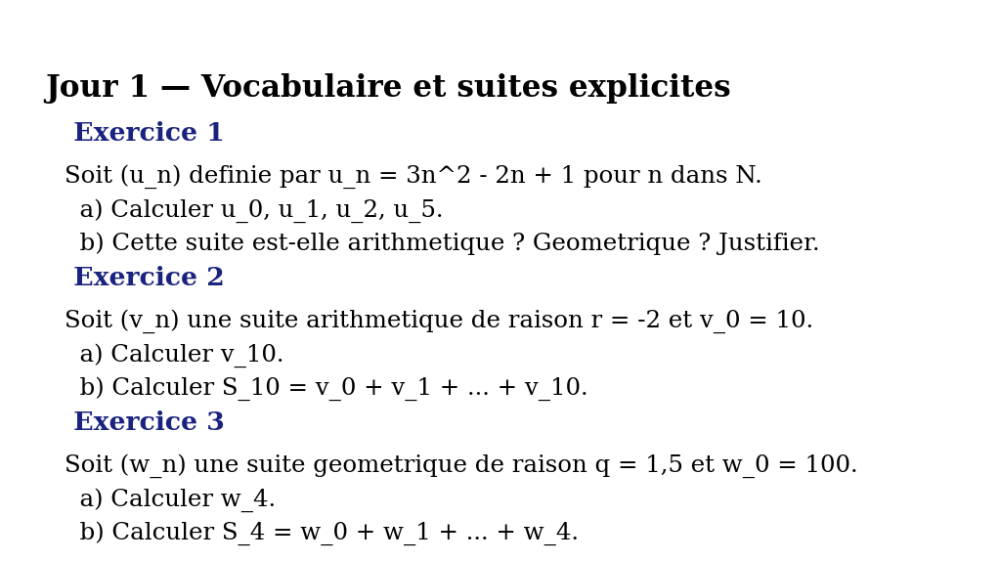

| ✅ **Corrigé** | Vérifier chaque résultat. Repérer les erreurs de signe. | 15 min |
|---|---|---|
| 🔑 **Fiche** | Notes formules suites arithmétiques & géométriques + domaines | 15 min |

### Jour 2 — Suites définies par récurrence

| 📺 **Hedacademy** | [Playlist Suites 1ère (rappels)](https://www.youtube.com/playlist?list=PLSOFOcyBRpIibAHTL_6vipZQog_LPaRDN) | 8 min |
|---|---|---|
| 📖 **Cours** | u_{n+1}=f(u_n). Méthode graphique (toile d'araignée). Il faut un premier terme + une relation. Représentation : placer u_0 sur f, construire u_1=f(u_0), etc. | 22 min |

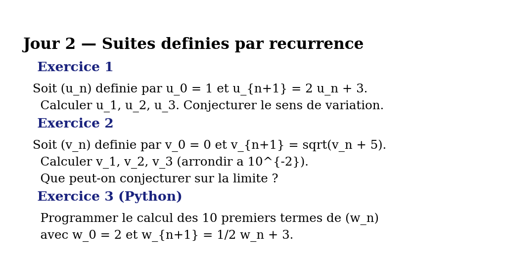

| ✅ **Corrigé** | Vérifier les calculs. Observer si variation conjecturée correcte. | 15 min |
|---|---|---|
| 💻 **Python** | coder le calcul des 10 premiers termes d'une suite récurrente | 10 min |

### Jour 3 — Sens de variation

| 📺 **Yvan Monka** | [LE COURS : Les suites - Terminale](https://www.youtube.com/watch?v=MJv7_pkFcdA) (début — variations) | 15 min |
|---|---|---|
| 📖 **Cours** | Deux méthodes : (1) u_{n+1}−u_n → étudier le signe. (2) Si u_n>0, u_{n+1}/u_n → comparer à 1. Suite croissante ⇔ ∀n, u_{n+1}≥u_n. Décroissante ⇔ ∀n, u_{n+1}≤u_n. | 25 min |

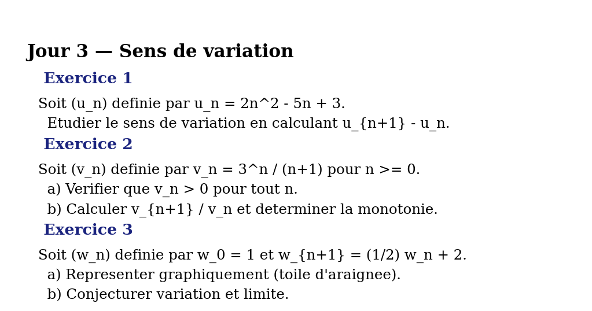

### Jour 4 — Raisonnement par récurrence

| 📺 **Hedacademy** | [Playlist Suites Terminale](https://www.youtube.com/playlist?list=PLSOFOcyBRpIhzlWY3pUXU_c6Zo2xn2Boy) (récurrence) | 12 min |
|---|---|---|
| 📖 **Cours** | Principe : Initialisation (P(0) vraie) + Hérédité (P(n)⇒P(n+1)) → P vraie ∀n. Structure de rédaction obligatoire. | 20 min |

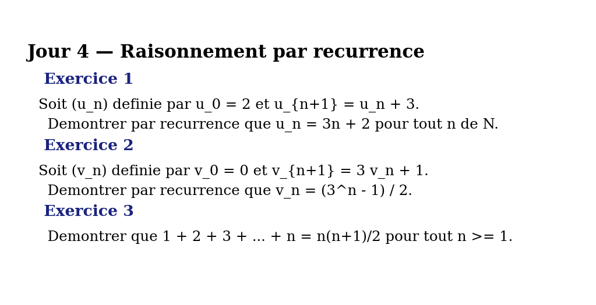

### Jour 5 — Suites arithmético-géométriques & bilan

| 📺 **Yvan Monka** | [LE COURS : Les suites - Terminale](https://www.youtube.com/watch?v=MJv7_pkFcdA) (13:00 — opérations, géométriques) | 15 min |
|---|---|---|
| 📖 **Cours** | Suite u_{n+1}=au_n+b (a≠1). Méthode : trouver α tel que α=aα+b (point fixe), poser v_n=u_n−α. Alors v_n est géométrique de raison a. | 20 min |

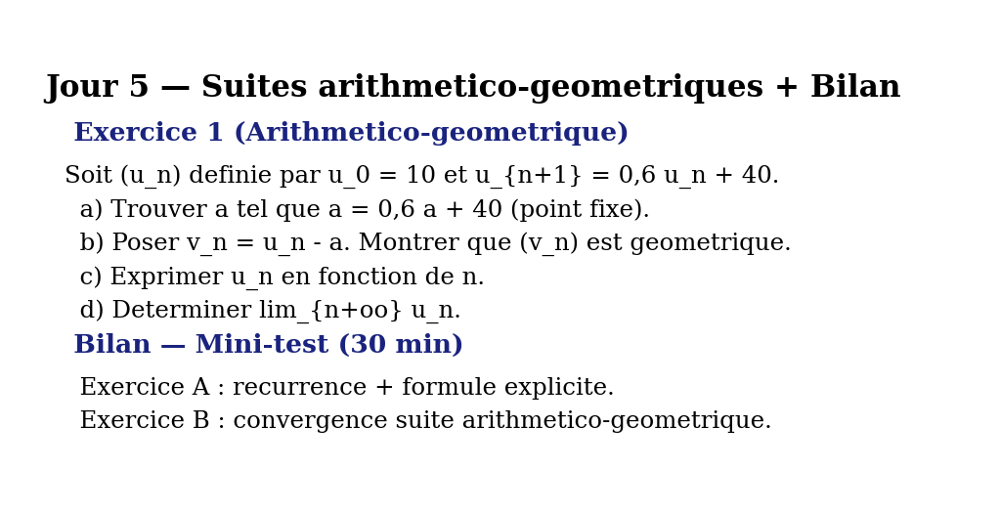

> **🎯 Objectif semaine 1** : Maîtriser les suites arithmétiques/géométriques, la récurrence, les bases des suites récurrentes

---

# 📅 Semaine 2 — SUITES (Suite) — Le cœur de l'analyse

### Jour 6 — Notion de limite d'une suite

| 📺 **Hedacademy** | [Les Suites - Terminale Spé](https://www.youtube.com/playlist?list=PLSOFOcyBRpIhzlWY3pUXU_c6Zo2xn2Boy) (limites) | 14 min |
|---|---|---|
| 📖 **Cours** | Définition intuitive : "u_n tend vers ℓ si pour tout intervalle ouvert contenant ℓ, tous les termes sont dedans à partir d'un certain rang". Limites de référence : 1/n→0, 1/n²→0, 1/√n→0. q^n : si q>1 → +∞, si −1<q<1 → 0. | 25 min |

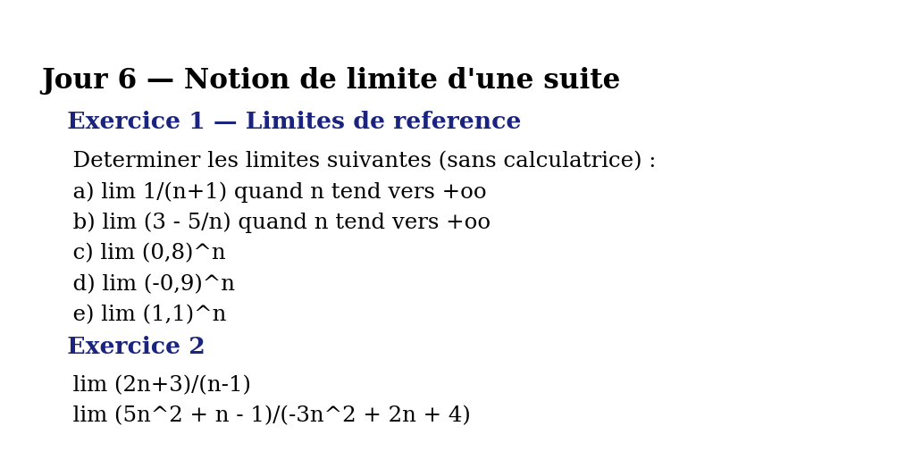

### Jour 7 — Opérations sur les limites

| 📺 **Yvan Monka** | [LE COURS : Les suites - Terminale](https://www.youtube.com/watch?v=MJv7_pkFcdA) (13:00 opérations) | 15 min |
|---|---|---|
| 📖 **Cours** | Tableaux opérations (somme, produit, quotient). Formes indéterminées : ∞−∞, 0×∞, ∞/∞. Technique : factoriser par le terme dominant. | 25 min |

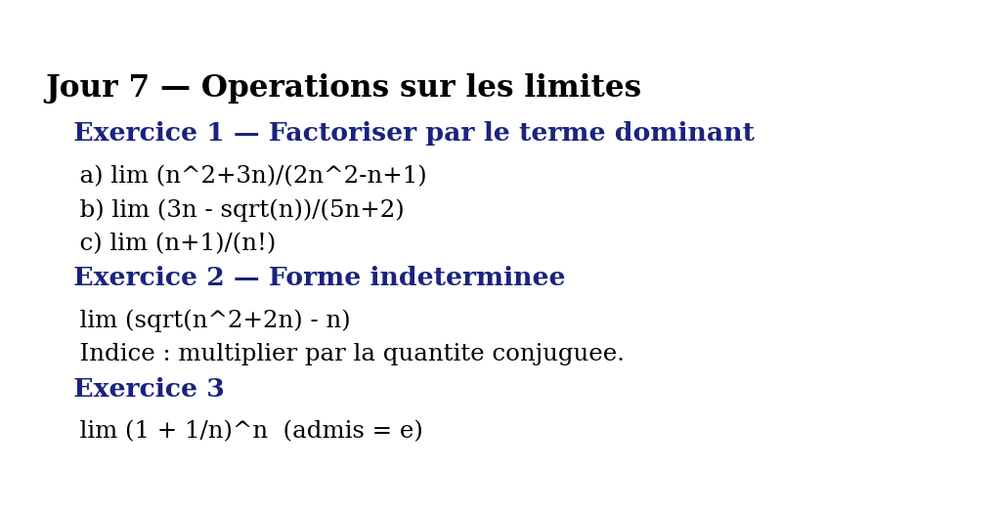

### Jour 8 — Théorèmes de comparaison & des gendarmes

| 📺 **Yvan Monka** | [Théorème de comparaison / gendarmes - Terminale](https://www.youtube.com/watch?v=MJv7_pkFcdA) (30:04) | 10 min |
|---|---|---|
| 📖 **Cours** | Comparaison : u_n≤v_n + lim u_n=+∞ ⇒ lim v_n=+∞. Gendarmes : u_n≤w_n≤v_n + lim u_n=lim v_n=ℓ ⇒ lim w_n=ℓ. Bernoulli : (1+h)^n ≥ 1+nh. | 25 min |

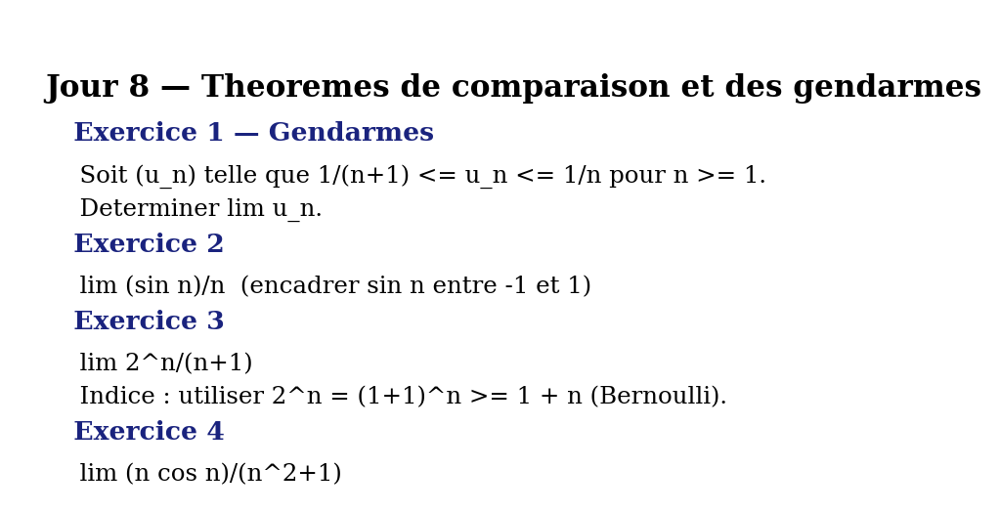

### Jour 9 — Convergence monotone & suite majorée/minorée

| 📺 **Yvan Monka** | [Convergence monotone - Terminale](https://www.youtube.com/watch?v=MJv7_pkFcdA) (34:53) | 12 min |
|---|---|---|
| 📖 **Cours** | Suite majorée (u_n≤M), minorée (u_n≥m), bornée. Théorème fondamental : croissante+majorée → converge. Décroissante+minorée → converge. Croissante non majorée → +∞. | 25 min |

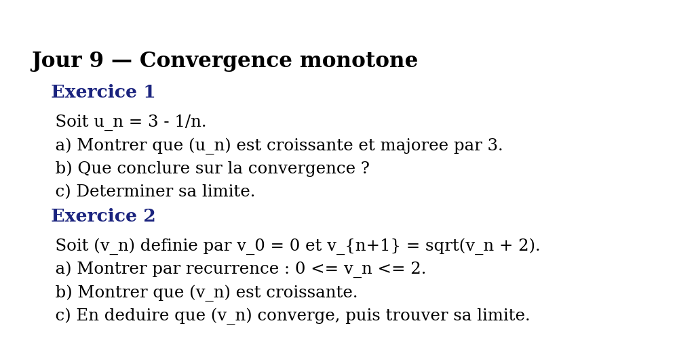

### Jour 10 — Suites récurrentes & bilan

| 📺 **Hedacademy** | [Les Suites - Terminale Spé](https://www.youtube.com/playlist?list=PLSOFOcyBRpIhzlWY3pUXU_c6Zo2xn2Boy) (récurrentes) | 20 min |
|---|---|---|
| 📖 **Cours** | Méthode type bac : ① f (domaine, var., point fixe ℓ) ② u_n∈I stable ③ Monotonie (f(x)−x) ④ Convergence ⇒ passage limite ⇒ f(ℓ)=ℓ | 15 min |

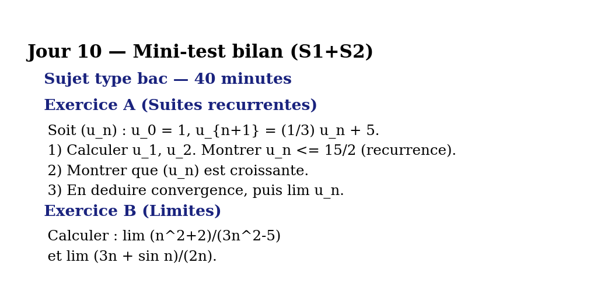

> **🎯 Objectif semaine 2** : Maîtriser limites, gendarmes, convergence monotone, suites récurrentes

---

# 📅 Semaine 3 — FONCTIONS : Limites, continuité, TVI

### Jour 11 — Limites de fonctions

| 📺 **Yvan Monka** | [LE COURS : Notion de limite d'une fonction](https://www.youtube.com/watch?v=YPwJyYDsmxM) | 15 min |
|---|---|---|
| 📖 **Cours** | Limite finie/infinie en +∞/−∞/en un point. Asymptote horizontale/verticale. Factorisation par le terme de plus haut degré. | 25 min |

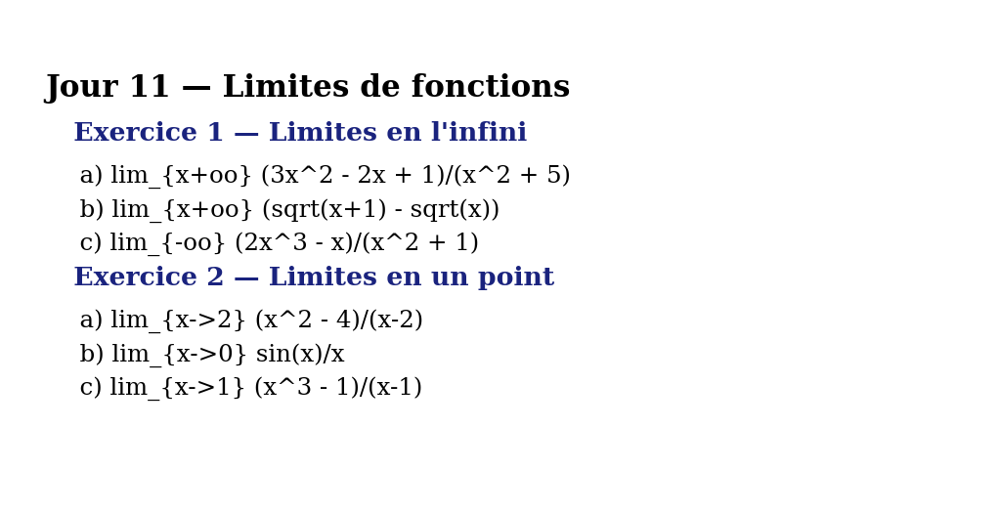

### Jour 12 — Continuité & TVI

| 📺 **Yvan Monka** | [LE COURS : Continuité d'une fonction - Terminale](https://www.youtube.com/watch?v=9SSEUoyHh2s) | 12 min |
|---|---|---|
| 📖 **Cours** | Fonction continue = courbe sans lever le crayon. Toute fonction dérivable est continue. TVI : si f continue sur [a,b] et k entre f(a) et f(b), alors ∃c∈[a,b] f(c)=k. | 25 min |

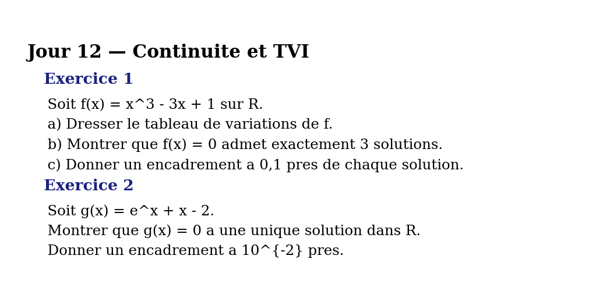

### Jour 13 — Fonction exponentielle (révision)

| 📺 **Hedacademy** | [Playlist Fonction exponentielle](https://www.youtube.com/@hedacademy) | 15 min |
|---|---|---|
| 📖 **Cours** | exp(x) unique f telle que f'=f et f(0)=1. exp(a+b)=exp(a)exp(b), exp(x)>0, limites. Dérivée e^{u} = u'e^{u}. | 25 min |

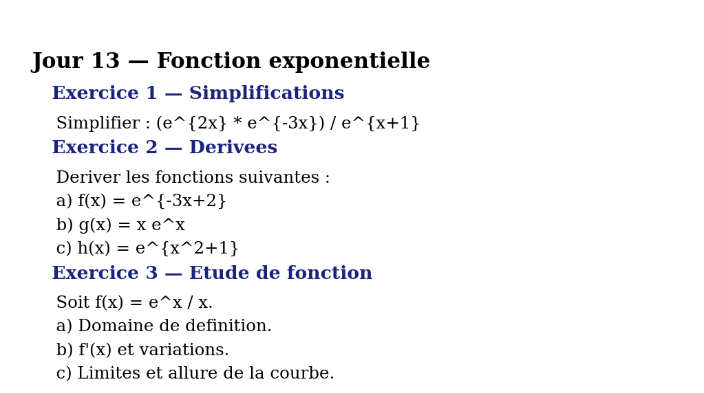

### Jour 14 — Dérivation (compléments terminale)

| 📺 **Yvan Monka** | [LE COURS : Dérivation - Terminale](https://www.youtube.com/watch?v=XAgdHblbajE) | 15 min |
|---|---|---|
| 📖 **Cours** | Rappels dérivées usuelles. Dérivée composée : (g∘f)' = f'×g'∘f. Dérivée seconde et convexité. | 25 min |

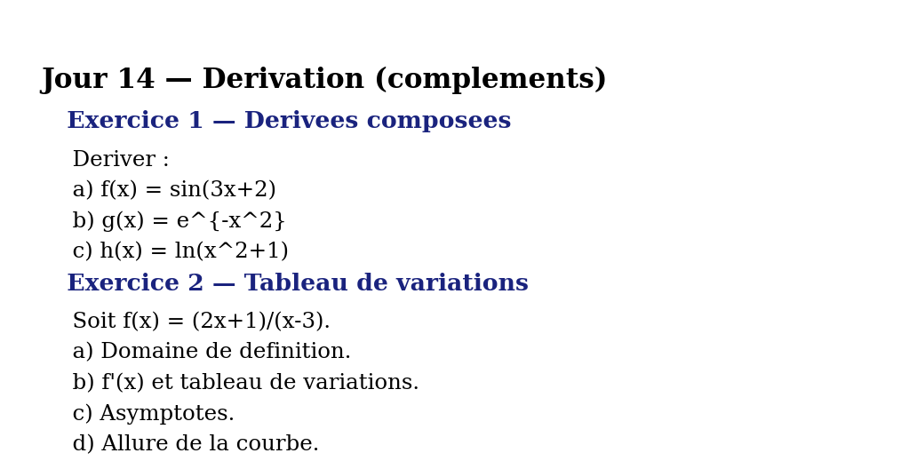

### Jour 15 — Bilan semaine 3

| 📝 **Mini-test 40 min** | 3 exercices mélangeant limites, TVI, exponentielle, dérivée | 40 min |
|---|---|---|
| ✅ **Auto-correction** | Vérifier chaque point | 20 min |
| 🔑 **Fiche** | Tableau dérivées + TVI + limites de référence | 30 min |

> **🎯 Objectif semaine 3** : Maîtriser limites fonctions, TVI, exponentielle, dérivées composées

---

# 📅 Semaine 4 — LOGARITHME, TRIGO & CONVEXITÉ

### Jour 16 — Logarithme népérien

| 📺 **Yvan Monka** | [LE COURS : Fonction logarithme népérien](https://www.youtube.com/watch?v=VJns0RfVWGg) | 15 min |
|---|---|---|
| 📖 **Cours** | ln(x) sur ]0,+∞[, ln(ab)=ln a+ln b, ln(a/b)=ln a−ln b, ln(a^n)=n ln a. ln(1)=0, ln(e)=1. Dérivée ln'(x)=1/x. ln(x)/x→0, x ln x→0. | 25 min |

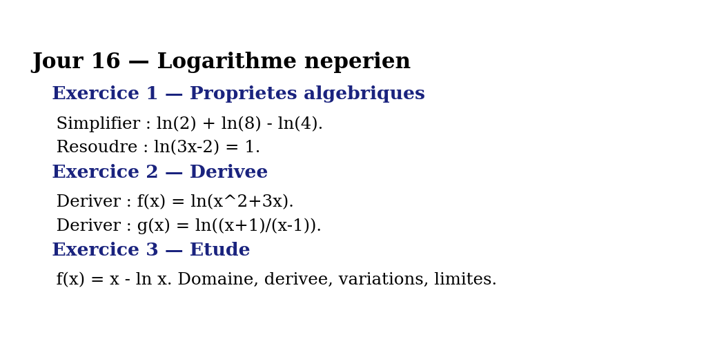

### Jour 17 — Logarithmes & limites

| 📺 **Hedacademy** | [Playlist Terminale Spé](https://www.youtube.com/playlist?list=PLSOFOcyBRpIhzlWY3pUXU_c6Zo2xn2Boy) (log) | 12 min |
|---|---|---|
| 📖 **Cours** | 4 limites à connaître : lim_{0⁺} ln x = −∞, lim_{+∞} ln x = +∞, lim_{+∞} ln x/x = 0, lim_{0⁺} x ln x = 0. Composée ln(u) : (ln u)' = u'/u. | 22 min |

| 📝 **Exos** | lim ln x / x² en +∞ ; lim x² ln x en 0⁺ ; lim (ln x)/ (x−1) ; dériver ln(√(x+1)) | 35 min |
|---|---|---|
| ✅ **Correction** | | 16 min |
| 🔑 **Fiche** | Propriétés ln + 4 limites | 5 min |

### Jour 18 — Fonctions sinus et cosinus

| 📺 **Yvan Monka** | [Playlist Dérivation - Tale Spé](https://www.youtube.com/playlist?list=PL_YUMxC_BtYNOjDC9PvfsDesucMvEhcqh) (trigo) | 12 min |
|---|---|---|
| 📖 **Cours** | sin' = cos, cos' = −sin. Sinus impair, cosinus pair. Périodiques 2π. Bornées [−1,1]. sin'(ax+b) = a cos(ax+b). | 25 min |

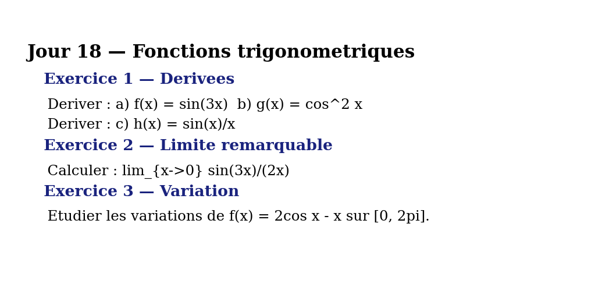

### Jour 19 — Convexité

| 📺 **Yvan Monka** | [LE COURS : Dérivation - Terminale](https://www.youtube.com/watch?v=XAgdHblbajE) (15:46 — convexité) | 10 min |
|---|---|---|
| 📖 **Cours** | f convexe ⇔ f''(x)≥0 (courbe au-dessus tangentes). f concave ⇔ f''(x)≤0 (courbe en-dessous). Point d'inflexion : f'' change de signe. e^x convexe, ln concave, x² convexe. | 25 min |

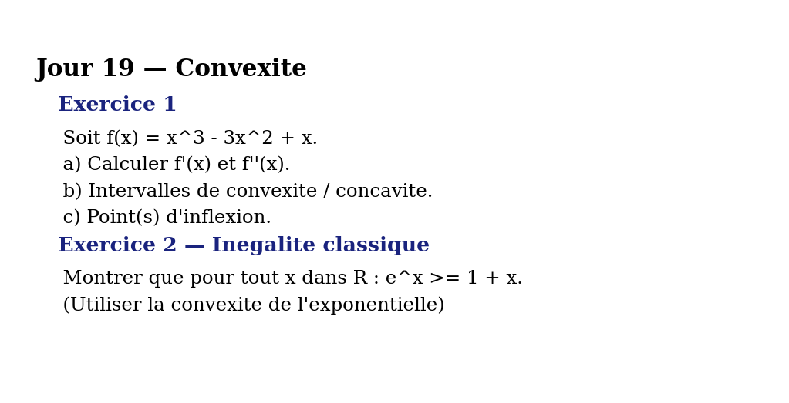

### Jour 20 — Bilan semaine 4

| 📝 **Mini-test 40 min** | ln, trigo, convexité | 40 min |
|---|---|---|
| ✅ **Correction** | | 20 min |
| 🔑 **Fiche** | Formulaire ln + dérivées trigo + convexité | 30 min |

> **🎯 Objectif semaine 4** : Maîtriser ln, bases trigonométrie, convexité, croissances comparées

---

# 📅 Semaine 5 — GÉOMÉTRIE DANS L'ESPACE & COMBINATOIRE

### Jour 21 — Vecteurs dans l'espace & repérage

| 📺 **Yvan Monka** | [LE COURS : Vecteurs, droites et plans de l'espace](https://www.youtube.com/watch?v=EoT48VtnUJ4) | 15 min |
|---|---|---|
| 📖 **Cours** | ℝ³, vecteurs (x,y,z), somme, multiplication scalaire, norme, colinéarité. Points alignés si vecteurs colinéaires. Milieu, distance entre deux points. | 25 min |

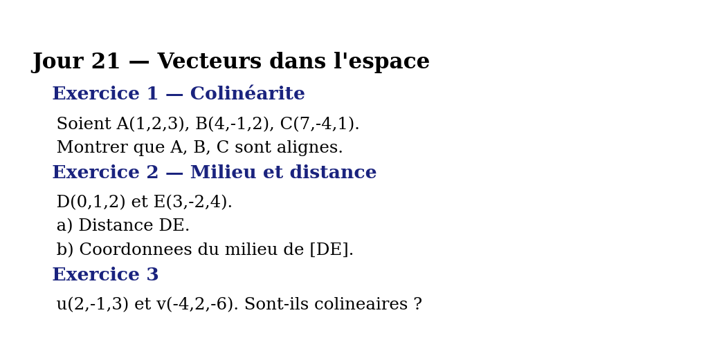

### Jour 22 — Droites et plans

| 📺 **Hedacademy** | [Playlist Terminale Spé](https://www.youtube.com/playlist?list=PLSOFOcyBRpIhzlWY3pUXU_c6Zo2xn2Boy) (géométrie) | 15 min |
|---|---|---|
| 📖 **Cours** | Représentation paramétrique droite : M = A + t v. Équation cartésienne plan : ax+by+cz+d=0. Vecteur normal n(a,b,c). Trois points non alignés → plan. | 25 min |

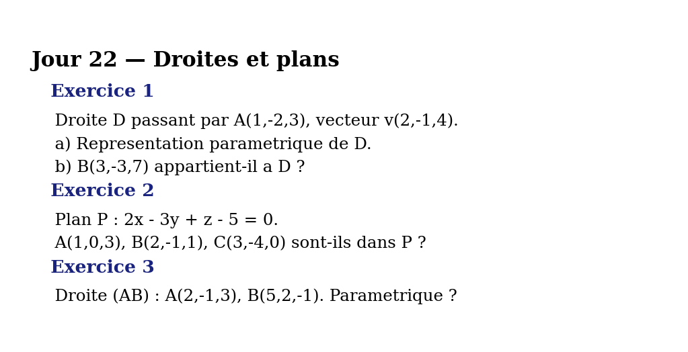

### Jour 23 — Orthogonalité & distances

| 📺 **Yvan Monka** | [Distance point à plan](https://www.youtube.com/watch?v=1b9FtX4sCmQ) | 10 min |
|---|---|---|
| 📖 **Cours** | Distance point à plan : d(M,P)=|ax₀+by₀+cz₀+d|/√(a²+b²+c²). Projeté orthogonal = plus court chemin. | 25 min |

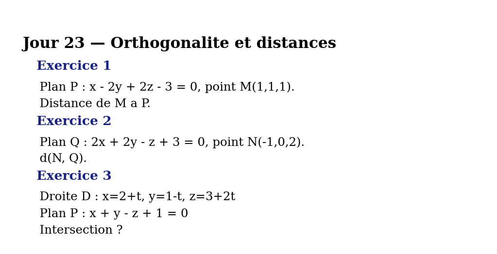

### Jour 24 — Combinatoire & dénombrement

| 📺 **Yvan Monka** | [Combinatoire - maths-et-tiques](https://www.maths-et-tiques.fr/index.php/cours-maths/niveau-terminale) | 12 min |
|---|---|---|
| 📖 **Cours** | n! = n×(n−1)×…×1. Arrangement A(n,k) = n!/(n−k)! (ordre important). Combinaison C(n,k) = n!/(k!(n−k)!) (ordre pas important). Triangle de Pascal. | 25 min |

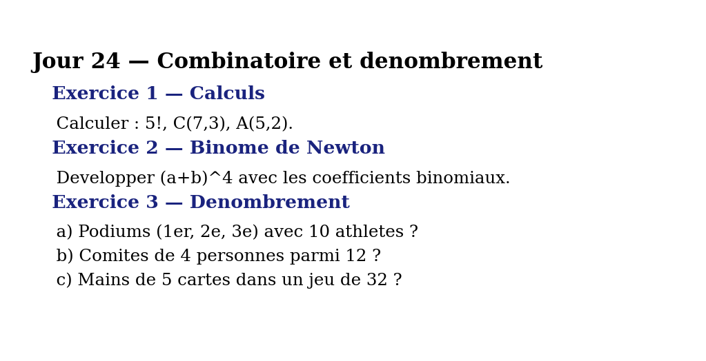

### Jour 25 — Bilan semaine 5

| 📝 **Mini-test 40 min** | géométrie espace + combinatoire | 40 min |
|---|---|---|
| ✅ **Correction** | | 20 min |
| 🔑 **Fiche** | Formules géométrie espace + combinatoire | 30 min |

> **🎯 Objectif semaine 5** : Maîtriser bases géométrie ℝ³, plans, distances, dénombrement

---

# 📅 Semaine 6 — PRIMITIVES, INTÉGRALES & PROBAS

### Jour 26 — Primitives

| 📺 **Yvan Monka** | [LE COURS : Les primitives - Terminale](https://youtu.be/bQ-eS1zZCdw) | 12 min |
|---|---|---|
| 📖 **Cours** | F primitive de f si F'=f. Tableau : x^n → x^{n+1}/(n+1), 1/x→ln|x|, e^x→e^x, sin→−cos, cos→sin. u'e^u = e^u, u'/u = ln|u|. | 25 min |

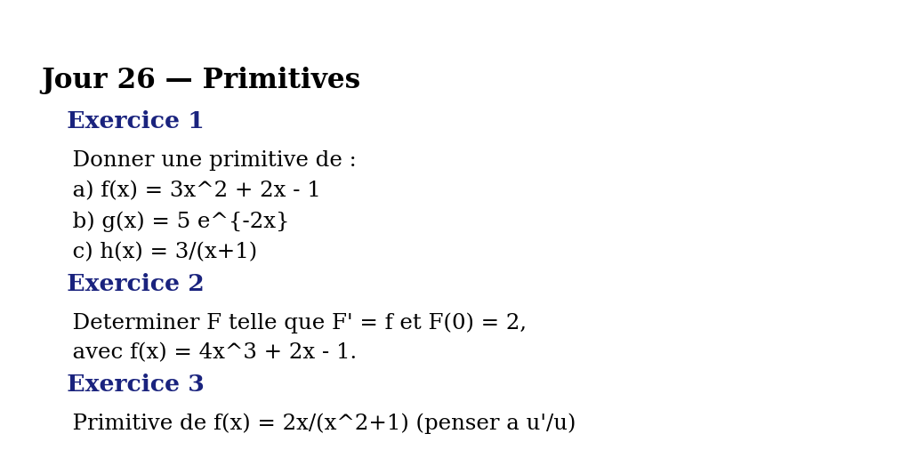

### Jour 27 — Calcul intégral

| 📺 **Yvan Monka** | [LE COURS : Intégration - Terminale](https://www.youtube.com/watch?v=pFKzXZrMVxs) | 15 min |
|---|---|---|
| 📖 **Cours** | ∫_a^b f = F(b)−F(a). Propriétés : linéarité, Chasles, positivité. Valeur moyenne = (1/(b−a))∫_a^b f. Aires : ∫|f−g|. | 25 min |

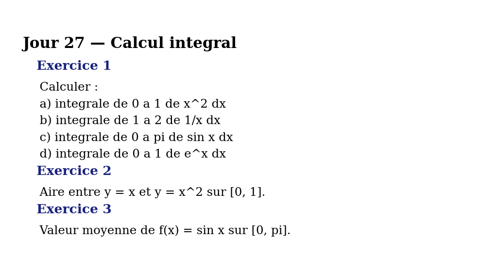

### Jour 28 — Loi binomiale (rappel 1ère)

| 📺 **Hedacademy** | [Playlist Terminale Spé](https://www.youtube.com/playlist?list=PLSOFOcyBRpIhzlWY3pUXU_c6Zo2xn2Boy) (loi binomiale) | 15 min |
|---|---|---|
| 📖 **Cours** | Schéma Bernoulli : n répétitions indép., succès p. X∼B(n,p). P(X=k)=C(n,k)×p^k×(1−p)^{n−k}. E=np, V=np(1−p). | 25 min |

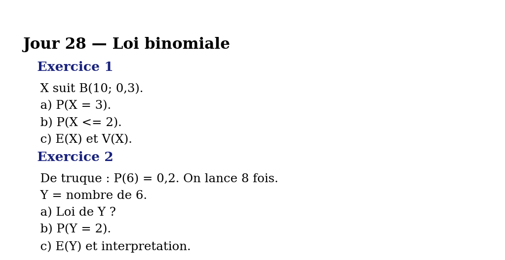

### Jour 29 — Somme de variables aléatoires

| 📺 **Hedacademy** | [Playlist Terminale Spé](https://www.youtube.com/playlist?list=PLSOFOcyBRpIhzlWY3pUXU_c6Zo2xn2Boy) (somme VA) | 12 min |
|---|---|---|
| 📖 **Cours** | X,Y indép. : E(X+Y)=E(X)+E(Y), V(X+Y)=V(X)+V(Y). Si X_i∼Bernoulli(p) alors S_n=∑X_i∼B(n,p). | 25 min |

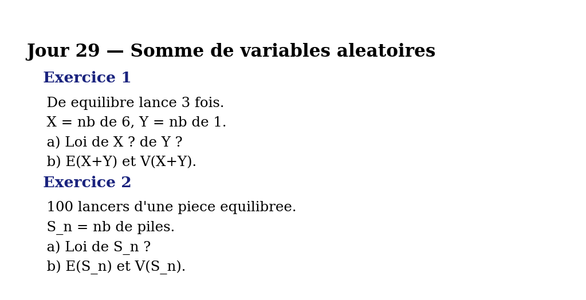

### Jour 30 — Bilan semaine 6

| 📝 **Mini-test 40 min** | primitives + intégrale + probas | 40 min |
|---|---|---|
| ✅ **Correction** | | 20 min |
| 🔑 **Fiche** | Tableau primitives + intégrales + formules probas | 30 min |

> **🎯 Objectif semaine 6** : Maîtriser les primitives usuelles, bases intégration, loi binomiale

---

# 📅 Semaine 7 — ÉQUATIONS DIFFÉRENTIELLES & RÉVISIONS

### Jour 31 — Équations différentielles y'=ay et y'=ay+b

| 📺 **Yvan Monka** | [LE COURS : Équations différentielles](https://www.youtube.com/watch?v=qHF5kiDFkW8) | 15 min |
|---|---|---|
| 📖 **Cours** | y'=ay → y(t)=Ce^{at}. y'=ay+b → y(t)=Ce^{at}−b/a. Condition initiale → C. Modélisation : radioactivité y'=−ky, Newton T'=k(T−T_a). | 25 min |

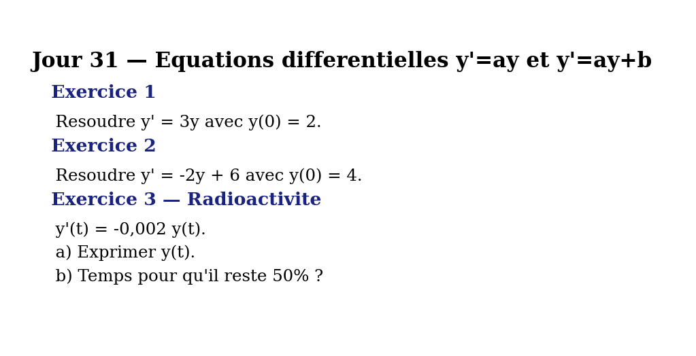

### Jour 32 — Applications équations différentielles

| 📺 **Hedacademy** | [Playlist Terminale Spé](https://www.youtube.com/playlist?list=PLSOFOcyBRpIhzlWY3pUXU_c6Zo2xn2Boy) (équa. diff.) | 12 min |
|---|---|---|
| 📖 **Cours** | Problèmes concrets : médicament y'=−ky, refroidissement, population. Savoir poser l'équation, résoudre, interpréter. | 25 min |

| 📝 **Exos** | Café 80°C ambiant 20°C, T'(t)=−0.1(T−20). Température à 10 min ? Temps pour 40°C ? | 38 min |
|---|---|---|
| ✅ **Correction** | | 15 min |
| 🔑 **Fiche** | Équations diff. + applications modélisation | 15 min |

### Jour 33 — Concentration & loi des grands nombres

| 📺 **Yvan Monka** | [Inégalité de Bienaymé-Tchebychev](https://www.youtube.com/watch?v=_ZzxgjAxrt4) | 15 min |
|---|---|---|
| 📖 **Cours** | Bienaymé-Tchebychev : P(|X−E(X)|≥δ) ≤ V(X)/δ². LGN : moyenne empirique → espérance. Sondages, échantillonnage. | 25 min |

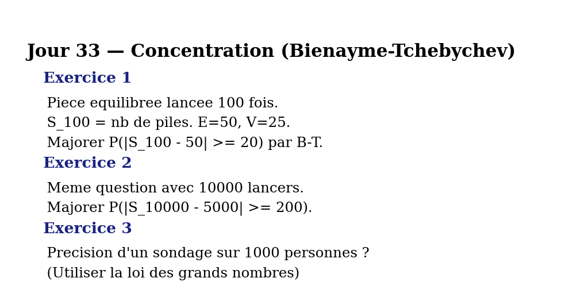

### Jour 34 — Grand oral maths — Préparation

| 📖 **Prépa** | Choisir 2 questions (voir ci-dessous) ; écrire un plan | 30 min |
|---|---|---|
| 📝 **Plan** | Introduction, développement (défs+théorème+exemple), conclusion (limites) | 30 min |
| 🗣️ **Oral blanc** 10 min | Présenter une question au chrono. S'enregistrer si possible | 30 min |

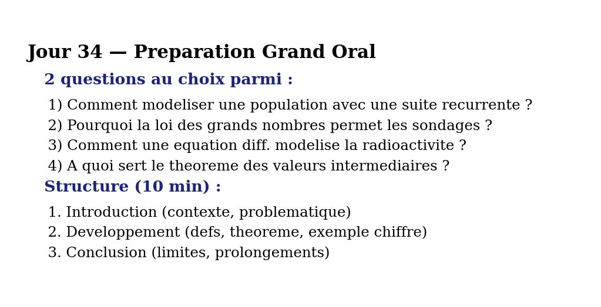

### Jour 35 — Bilan semaine 7

| 📝 **Mini-test 40 min** | équations diff. + Bienaymé-Tchebychev | 40 min |
|---|---|---|
| ✅ **Correction** | | 20 min |
| 🔑 **Fiche** | Résumé équations diff. + formule Bienaymé-Tchebychev | 30 min |

> **🎯 Objectif semaine 7** : Maîtriser équations différentielles, inégalité de concentration, préparer oral

---

# 📅 Semaine 8 — BILAN GÉNÉRAL & TEST FINAL

### Jour 36 — Synthèse analyse

| 📝 **Révisions** 1h30 | 1 suite récurrente (complète), 1 fonction (ln/exp), 1 intégrale+primitive | 1h30 |

### Jour 37 — Synthèse géométrie + probas

| 📝 **Révisions** 1h30 | 1 problème géométrie espace (droite, plan, distance), 1 problème proba (binomiale+Bienaymé-Tchebychev) | 1h30 |

### Jour 38 — SUJET BLANC n°1

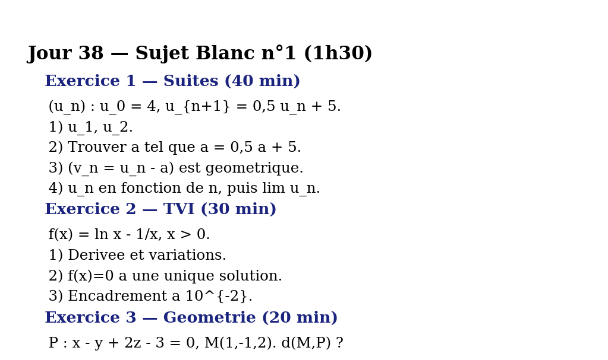

### Jour 39 — SUJET BLANC n°2

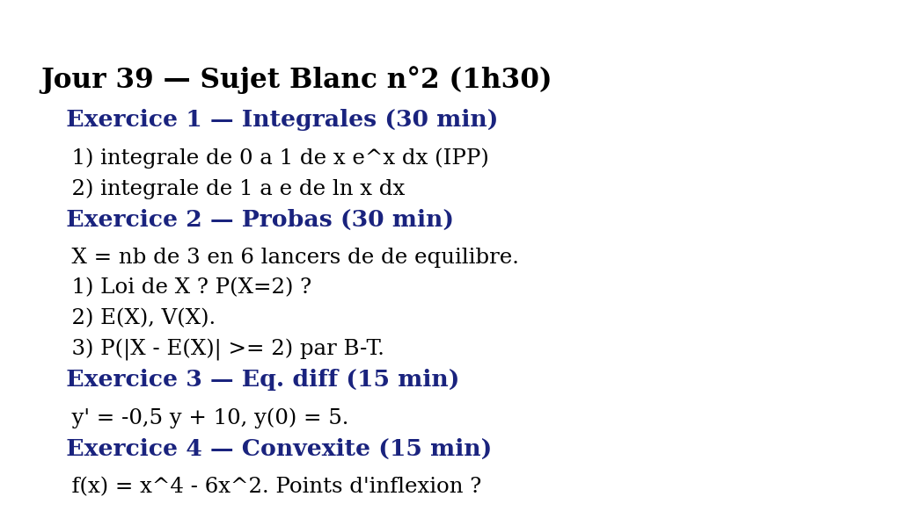

### Jour 40 — Bilan final & perspectives

| ✅ | Corriger les 2 sujets blancs — comparer avec barème | 45 min |
|---|---|---|
| 📝 | **Grille d'auto-évaluation** (ci-dessous) | 15 min |
| 📖 | **Objectifs de rentrée** : "Cette année, je veux progresser sur…" | 10 min |
| 🔑 | **Classeur de rentrée** : trier fiches, ranger par chapitre | 20 min |

---

## 📊 Grille d'auto-évaluation finale

À remplir honnêtement après la semaine 8 pour savoir où tu en es :

| Compétence | 😰 À retravailler | 🙂 Moyen | 💪 OK | 🏆 Maîtrise |
|---|---|---|---|---|
| Suites arithmétiques/géométriques (calculs, formules) | | | | |
| Raisonnement par récurrence (rédaction complète) | | | | |
| Limite de suite (q^n, 1/n^k, opérations) | | | | |
| Théorème des gendarmes / comparaison | | | | |
| Convergence monotone (croissante + majorée) | | | | |
| Suite récurrente u_{n+1}=f(u_n) — méthode complète | | | | |
| Limites de fonctions (factorisation, FI) | | | | |
| TVI (montrer existence/unicité solution) | | | | |
| Fonction exponentielle (dérivée, limites, variations) | | | | |
| Dérivée composée (sin, exp, ln) | | | | |
| Logarithme népérien (propriétés, dérivée, limites) | | | | |
| Convexité (f'', point d'inflexion) | | | | |
| Fonctions sinus / cosinus (dérivée, limites) | | | | |
| Géométrie espace (vecteurs, plans, paramétriques) | | | | |
| Distance point à plan | | | | |
| Combinatoire (factorielle, C(n,k), binôme) | | | | |
| Primitives usuelles | | | | |
| Calcul intégral (∫_a^b, propriétés) | | | | |
| Loi binomiale (P(X=k), E, V) | | | | |
| Somme variables aléatoires | | | | |
| Équations différentielles (y'=ay+b) | | | | |
| Inégalité Bienaymé-Tchebychev | | | | |

---

## 🔑 Liens YouTube — Accès rapide

| Chaîne | Lien | Contenu |
|---|---|---|
| **Yvan Monka** | https://www.youtube.com/@ymonka | 1900+ vidéos, tous niveaux |
| Playlist Suites Tale Spé | https://www.youtube.com/playlist?list=PLVUDmbpupCarZdaGUMO7DV35pi1I8zIJZ | 10+ vidéos |
| Playlist Suites 1ère (rappels) | https://www.youtube.com/playlist?list=PLVUDmbpupCaoqExMkHrhYvWi4dHnApgG_ | Généralités |
| Playlist Exos bac corrigés | https://www.youtube.com/playlist?list=PLVUDmbpupCarel-yIVSv9c0sz9uuldDNv | Sujets entiers |
| Site web Yvan Monka | https://www.maths-et-tiques.fr/index.php/cours-maths/niveau-terminale | Cours PDF + vidéos |
| **Hedacademy** | https://www.youtube.com/@hedacademy | 1M abonnés, dynamique |
| Playlist Suites Term Spé | https://www.youtube.com/playlist?list=PLSOFOcyBRpIhzlWY3pUXU_c6Zo2xn2Boy | 10 vidéos clés |
| Playlist Suites 1ère | https://www.youtube.com/playlist?list=PLSOFOcyBRpIibAHTL_6vipZQog_LPaRDN | Bases |

---

## 📋 Notes pour l'élève

- **Semaine 1-2** : priorité sur les suites (c'est le socle de l'analyse)
- **Semaine 3-4** : fonctions | **Semaine 5** : géométrie + combinatoire
- **Semaine 6** : primitives/intégrales/probas | **Semaine 7** : équations diff.
- **Semaine 8** : 2 sujets blancs en conditions réelles
- Si un jour est sauté → rattraper le week-end (max 7h30/sem)
- Une vidéo ne remplace pas le cours papier — noter les formules dans un carnet

> **Document préparé pour l'été précédant la Terminale — Spécialité Mathématiques**
> **Chaînes YouTube** : Yvan Monka (M@ths et tiques) · Hedacademy
> **Charge** : 1h30/jour · 5j/semaine · 8 semaines
> **Programme officiel** : BO n°31 du 30/07/2020 (515414)
